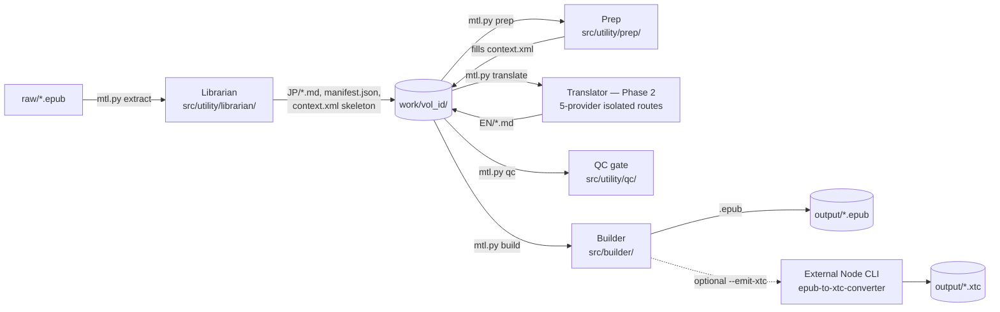

# Architecture Map — LLM Translator (Lightweight Client)

Reference document for anyone maintaining this codebase. Every claim below is grounded
in a file actually opened in this repo — paths and line numbers are cited so you can
verify or re-anchor after a refactor shifts them.

## Scope Disambiguation

**This repo is the standalone "LLM Translator" lightweight client.** It is
a deliberately small (~150-line translator vs. a ~2500-line predecessor), self-contained
pipeline: extract → prep → translate → qc → build. It is **not** the larger "MTL_STUDIO"
production pipeline (Librarian/Metadata Processor/Planner/Post-Processor/Auditors,
Gemini+Anthropic two-family routing, `WORK/<vol>/PLANS/`, ChromaDB vector stores)
described by an unrelated, differently-scoped reference elsewhere. Some terminology
overlaps by convention (both use `context.xml`, `manifest.json`, `WORK/<volume_id>/`),
but the module layouts, phase numbering, and provider architecture are independent.
Do not import assumptions from that other pipeline into this one.

## Pipeline Overview



Composite entry point `mtl.py run <epub_path>` chains all five phases in order
(`scripts/mtl.py:147-172`). Each phase is also independently invocable.

## Directory Map

```
D:/MTLS/
├── scripts/mtl.py          # CLI entry point — all 8 subcommands (see Entry Points)
├── mtl.bat / mtl.sh        # Python CLI launchers (venv detection, dep auto-install)
├── mtl-ts.bat / mtl-ts.sh  # TypeScript TUI launcher (npm install + npm start)
├── config.yaml             # Master runtime config — see Config Reference below
├── requirements.txt        # Python deps (anthropic, openai, pyyaml, lxml, bs4, Pillow, tiktoken, mcp)
├── raw/                    # Input EPUBs (JP source)
├── work/                   # Per-volume working directories (JP/, EN/, context.xml, manifest.json, THINKING/, LOG/, QC/)
├── output/                 # Final built EPUBs (+ optional .xtc/.xtch)
├── bibles/                 # Cross-volume series continuity (term_lock.json, verbatim_anchors.json, series_pack.json) — created on first write
├── dev/                    # Reference material, not shipped logic (RAGs/, integration notes, font assets)
├── tests/                  # test_deepseek_pricing.py, test_glm_provider.py, test_openai_provider.py, test_qwen_provider.py (no dedicated DeepSeek or Anthropic *provider* file — see Known Gaps)
├── src/
│   ├── __init__.py
│   ├── Deepseek/           # DeepSeek Phase-2 route + ALL shared cross-provider infrastructure
│   │   ├── translator/     # DeepSeekTranslator + DRDI/DOVB optimization + prompt/conversation/dry_run
│   │   ├── prompt/         # DeepSeek + prep master prompts (XML/MD)
│   │   ├── common/         # config.py, atomic_io.py, llm_types.py, token_telemetry.py, os_config.py, interactive.py
│   │   └── mcp/            # MCP server + 6 tool-server modules (server.py, harness.py, runtime.py, servers/*.py)
│   ├── Qwen/               # Qwen Phase-2 route (client, agent, conversation, safety_fallback, prompts/)
│   ├── OpenAI/              # OpenAI Responses Phase-2 route (client, agent, conversation, batch, response, prompts/)
│   ├── Anthropic/          # Anthropic Messages Phase-2 route (client, agent, conversation, batch, response, prompts/)
│   ├── GLM/                # Z.AI GLM Phase-2 route (client, agent, conversation, prompts/) — Chat Completions
│   ├── builder/             # Phase-4 EPUB assembly + device profiles + XTC/XTCH export
│   └── utility/
│       ├── librarian/       # Phase-1 EPUB extraction (largest single module, 3576 lines)
│       ├── prep/            # context.xml builder (deepseek multi_turn/parallel ladder, or minimax/glm cache-loop tier)
│       └── qc/               # Filesystem-only QC gate (zero API calls)
└── ts/                      # Standalone Ink/React terminal UI — pure client, no pipeline logic of its own
```

## Phase 1 — Librarian (`src/utility/librarian/`)

Entry point: `run_librarian()` (`agent.py:3502`) → `LibrarianAgent.process_epub()`
(`agent.py:~196`). Pipeline: `EPUBExtractor.extract` → `MetadataParser.parse_opf` →
`TOCParser`/`SpineParser` → multi-act/publisher-profile spine-fallback heuristics →
`XHTMLToMarkdownConverter` → image cataloging → `Manifest` save.

| Module | Purpose |
|---|---|
| `agent.py` | Orchestrator; `ChapterEntry`/`PipelineState`/`Manifest` dataclasses. Has its own `-m` CLI entry (used by the MCP server's subprocess shell-out), separate from `scripts/mtl.py`. |
| `epub_extractor.py` | Zip extraction, working-dir layout, OPF metadata → feeds `context.xml`'s `<opf_metadata>`. |
| `content_parser.py` / `content_splitter.py` | Per-file title/body parsing; token-budget and Kodansha-format chapter splitting. |
| `file_discovery.py` | Filename-pattern fallback chapter discovery, independent of TOC/spine. |
| `image_extractor.py` | JPEG magic-byte detection, dimension/orientation, cover/kuchie/illustration cataloging. |
| `metadata_parser.py` | OPF title/author/language; sequel detection (`detect_sequel_from_opf`/`_from_title`); `load_previous_metadata`/`merge_metadata` are marked deprecated legacy, left in place. |
| `spine_parser.py` / `toc_parser.py` | Reading-order and TOC/NCX parsing. |
| `xhtml_to_markdown.py` | 739-line converter — ruby/furigana handling, clean markdown output. |
| `publisher_profiles/manager.py` | ~1050-line publisher-detection/pattern-matching engine driving TOC-fallback heuristics. |

Reads `config.yaml`'s `paths:` (13-18) block; no other top-level key.

## Prep — context.xml Builder (`src/utility/prep/`, NOT inside `translator/`)

`translator/context_manager.py` only **reads** an existing `context.xml`
(`load_context_xml`, 12 lines) — it never builds one. The actual builder is
`src/utility/prep/agent.py::run_prep(volume_id, series_id=None)`. It first reads
`prep.provider` (`agent.py:458`, config.yaml:37, `deepseek | minimax | glm | openai`) —
when the value is `openai` it dispatches to `src/OpenAI/prep.py::run_openai_prep`,
which reuses the DeepSeek-derived system prompt and per-block JSON-node schemas.
The native Responses Batch route submits every active block in one durable job,
records accepted jobs before polling, and falls back to synchronous Responses
calls when `prep.openai.batch.enabled` is false. Completed nodes are resumed
from `.context/openai_prep/` and assembled by the same deterministic XML path.
When the value is `minimax` or `glm` it dispatches straight to
`_run_cache_loop_prep`
(`agent.py:368-431,459-460`), a shared cache-loop tier reusing
`src/Deepseek/prep/prep_cache_client.py`'s OpenAI/Anthropic-style wire path with a
per-provider prefix file (`.dsh/prep/prefix_glm.md` for GLM, `.dsh/prep/prefix.md`
otherwise) and reasoning-effort default. For `deepseek` (the fallback default), it
dispatches in order:

1. `prep.multi_turn.enabled` → `multiturn_agent.run_multiturn_prep` —
   one persisted sequential DeepSeek conversation, 15 JSON-node turns, and atomic assembly.
2. `prep.parallel.enabled` is disabled and mutually exclusive with multi-turn prep; it remains
   available only as an explicitly selected legacy strategy.
3. Automatic unified fallback is disabled by default so a failed run preserves artifacts instead
   of silently spending on a second strategy.

The active path fails closed after a turn or assembly error and preserves its JSON artifacts for explicit retry; it does not silently launch another strategy. `prep/agent.py` deliberately
does **not** reuse `DeepSeekClient` — it has its own minimal Anthropic-SDK caller and
prep-specific conversation history, so the translator's client config cannot silently alter
its stable-prefix contract. Sequel detection
(`discover_series_bible`, `agent.py:~180-215`) matches this volume's JP title against
`bibles/<series_id>/series_pack.json`. All routes converge on `_finalize_and_write`
(`agent.py:~239`), which writes `context.xml` atomically, updates
`manifest.json.pipeline_state.prep`, and extracts `TRANSLATION_BRIEF.md`.

Reads `config.yaml`'s `prep:` block (34-220) in full — the block grew considerably
with the `minimax:`/`glm:` cache-loop tiers alongside the original `deepseek`-path
knobs.

Series continuity (`src/utility/bible/agent.py::run_write_bible`) is a **separate,
real, wired module** — merges one volume's populated `context.xml` into
`bibles/<series_id>/{term_lock.json, verbatim_anchors.json, series_pack.json}`.
Note: `src/Deepseek/mcp/runtime.py` carries a stale comment claiming "series bibles
are out of scope for the lightweight client" — that is outdated; `bible_server.py`
and this module are real and MCP-wired (`write_bible` tool).

## Phase 2 — Translator: 5-Provider Isolated-Route Architecture

**Five providers are wired today: DeepSeek, Qwen, OpenAI, Anthropic, GLM.** All five
are real, dispatched packages — confirmed directly against the module contents
(`src/Anthropic/` carries `agent.py, batch.py, client.py, config.py, context.py,
conversation.py, errors.py, optimization.py, prompt_loader.py, response.py,
prompts/`; `src/GLM/` carries the same isolated-route shape minus `batch.py`/
`response.py`) and against both dispatch sites below. There is no empty-stub
provider directory in this codebase as of this revision.

### Dispatch

Single source of truth: `src/Deepseek/translator/provider.py::get_translator_class()`
/ `get_volume_translator()` (5 branches each: `qwen`, `openai`, `anthropic`, `glm`,
`deepseek`, in that literal order, `provider.py:10-29`), and
`scripts/mtl.py::_resolve_translate_volume()` (`mtl.py:75-83`, same 5 branches). Both
read `config.yaml`'s `translation.provider` (line 229, enum
`deepseek | qwen | openai | anthropic | glm`); an unrecognized value raises
`ValueError` naming all five.

### Isolated-Route Convention

Each provider is a **fully self-contained package** under `src/<Provider>/` — its own
`client.py` (request construction + retry), `config.py` (config.yaml reader),
`prompt_loader.py`, `conversation.py` (replay/persistence ledger), `errors.py`
(exception classification), `context.py` (context.xml parsers), `optimization.py`
(chapter guidance), `agent.py` (`<Provider>Translator` + `translate_volume` entry
point), `prompts/`. **No shared base class** — DeepSeek's and Qwen's `agent.py` each
carry independent, near-identical `_maybe_write_thinking_log`/
`_maybe_rebuild_density_map` methods rather than a shared mixin; this duplication is
the deliberate convention (see `mtls-llm-provider-client` skill for the full
rationale and a step-by-step guide to adding/debugging a route).

| Provider | Package | Model (config default) | Native reasoning artifact | Extra module |
|---|---|---|---|---|
| DeepSeek | `src/Deepseek/translator/` | `deepseek-v4-pro` | `thinking.budget_tokens` + DRDI (prose-injected CoT scaffolding — no native effort knob) | `deepseek_optimization.py` (DRDI/DOVB/CCT), `thinking_density.py` (density-map telemetry) |
| Qwen | `src/Qwen/` | `qwen3.8-max` | Native hybrid thinking | `safety_fallback.py` (moderation-refusal → DeepSeek inheritance) |
| OpenAI | `src/OpenAI/` | `gpt-5.6-terra` (Astra-ready) | `reasoning.summary` (opt-in, model-generated paraphrase — **not** raw CoT; requires org verification + model-tier support, neither detectable from this codebase) | `response.py` (lossless Responses-payload decoder), model-scoped fallback ledgers |
| Anthropic | `src/Anthropic/` | `claude-sonnet-5` (`claude-opus-5`/`claude-fable-5` also selectable) | Adaptive thinking (`thinking.enabled`), 128K max output uniform across all three models | `batch.py` (extra module no other route has), `response.py` (Messages-payload decoder) |
| GLM | `src/GLM/` | `glm-5.3-flash` (`glm-5.3` for the flagship tier) | Native thinking with `reasoning_effort` (`low`/`high`/`max`), implicit prefix caching, cannot be fully disabled | GLM-owned prompt, context, conversation, and moderation handling |

Shared infrastructure every provider's `agent.py` imports from `src/Deepseek/`
(despite the package name, these are cross-provider, not DeepSeek-specific):
`common/llm_types.py` (`LLMResponse`/`LLMUsage`/`LLMTermination`/`LLMApiFamily` —
the normalized contract every client returns), `common/token_telemetry.py`
(pricing table + `log_call()` → `WORK/<vol>/LOG/token_log_*.md`),
`common/atomic_io.py` (`atomic_write_text`/`atomic_write_json`, Windows-lock-retry
safe writes), `translator/thinking_output.py` (`split_thinking_from_output`,
`merge_thinking_log` — shared by all five routes, confirmed via direct import in
`src/Anthropic/agent.py:39` and `src/GLM/agent.py:17`),
`translator/thinking_density.py` (`build_density_report` — shared density-map
renderer for `THINKING/density_map.html`), `translator/dry_run.py`
(`write_dry_run_prompt` — shared dry-run payload writer for all five routes).

Provider-specific prompt and context assembly remains isolated: `src/GLM/context.py`
owns its parser implementations rather than re-exporting `src/Qwen/context.py`, so
future Qwen parser changes cannot silently alter GLM behavior.

Reads `config.yaml`'s `translation:` block (221-855) — see Config Reference.

## Phase QC — Filesystem-Only Gate (`src/utility/qc/agent.py`)

`run_qc(volume_id)` (`agent.py:110`) — zero API calls, zero API-key dependency,
&lt;5s per volume per its own docstring. Checks: EN/ output existence per JP
chapter, trailing-punctuation truncation heuristic, JP:EN token-ratio outliers
(tiktoken with char-count fallback), missing heading/scene-break structural flags,
and locked-name-vs-EN-text fuzzy drift (`difflib.SequenceMatcher` against
`context.xml`'s `name_map`/`character_roster`). Explicitly **not** a re-implementation
of any heavier multi-model QC system — a fast, deterministic sanity gate only.

## Phase 4 — Builder (`src/builder/`)

Entry point: `run_builder()` (`agent.py:2863`) → `BuilderAgent.build_epub()`
(`agent.py:534-542`, an 8-step `[STEP N/8]` pipeline): load `manifest.json` → build
OEBPS tree in a temp dir → convert markdown chapters → copy/optimize images →
generate nav/OPF → `EPUBPackager.package_epub` (`epub_packager.py:17`, the real
zip-assembly logic — no free-standing `package_epub` in `agent.py` itself) →
`EPUBPackager.validate_epub_structure` → optional XTC/XTCH export.

### Device Profiles (`device_profiles.py`)

Single source of truth for target-hardware presets. `PROFILES` registry (4 entries):

| Profile | Screen | Notes |
|---|---|---|
| `passthrough` | — | Byte-for-byte pre-refactor behavior; not for shipping. |
| `standard` | — | 300 PPI (Kindle/Kobo/tablets); `image_box=(1200,1800)`, baseline JPEG forced. |
| `xteink-x3` | 528×792, 259 PPI | CrossPoint firmware; 8-bit grayscale (never pre-dithered — firmware dithers itself), SVG unwrapped, tables flattened, `EINK_CSS`. |
| `xteink-x4` | 480×800, 219 PPI | Same shape as x3, different panel size. |

`resolve_profile(name)` (`~195-215`) raises `UnknownProfileError` on an unknown name
— resolved **eagerly at `BuilderAgent.__init__`** so a bad `--profile` fails before
any work starts, not mid-build. `device_budgets.py` is a **warning-only** auditor
(never fails a build) checking chapter byte size, anchor-ID count, table presence,
and unsupported CSS against the profile's `Budgets`. `stylesheets.py::EINK_CSS`
documents CrossPoint's CSS engine implementing exactly 9 properties with a
non-cascading 4-level selector priority (inline > class > tag > default) — no
descendant/child/attribute selectors, no `!important`.

### XTC/XTCH Export (`xtc_export.py`) — External Dependency

Optional, non-fatal companion artifact (`BuildResult.xtc_ok`: `None`=not requested,
`False`=requested+failed, `True`=succeeded — a failed export never fails the build).
Delegates to `bigbag/epub-to-xtc-converter`, a Node/CREngine-WASM CLI, **deliberately
never vendored into this repo**. On this machine it is cloned to
`D:/epub-to-xtc-converter` (sibling directory, outside the repo), with `npm install`
run in its `cli/`.

Three precondition resolvers (`_resolve_node`/`_resolve_cli`/`_resolve_font`) each
raise a human-readable `XtcPreconditionError` caught by `export_xtc()` and returned
as `XtcResult(ok=False, error=...)` — never propagates into the build.

- **Font contract**: `.ttf`/`.otf` only. The device's native `.cpfont` format
  (CrossPoint firmware's own proprietary pre-rasterized bitmap container — literal
  `"CPFONT\0\0"` magic header) is **rejected by design**: CREngine's FreeType-based
  rasterizer needs an outline font, not a pre-baked device bitmap cache. Current
  wiring: `builder.xtc.font_path` → `D:/epub-to-xtc-converter/fonts/Bookerly-Regular.ttf`
  (XTEINK-spec'd Bookerly, sourced from `dev/Bookerly/`).
- **Single-face limitation**: the converter's own `converter.js` calls
  `registerFontFromMemory()` exactly **once** per run — there is no bold/italic slot
  anywhere in `cli/settings.js`'s schema. CREngine synthesizes bold/italic
  algorithmically from the one registered Regular face. This is the external tool's
  real ceiling, not a gap in this repo's wiring.
- **`builder.xtc.enabled` is advisory only** — `get_xtc_config()` returns it verbatim
  but `BuilderAgent.build_epub`'s XTC block branches purely on whether the
  `emit_xtc` argument (CLI `--emit-xtc xtc|xtch`) was passed. No code path reads
  the `enabled` key. Don't assume flipping it changes runtime behavior.

Verified end-to-end this session: a real production EPUB rendered through
`export_xtc()` with this exact wiring produced a genuine 1395-page, 67 MB `.xtc`
container with a valid CrossPoint header.

Reads `config.yaml`'s `builder:` block (856-919) — see Config Reference.

## Entry Points

### CLI (`scripts/mtl.py`, launched via `mtl.bat`/`mtl.sh`)

8 subcommands (`build_parser()`, `mtl.py:218-330`):

| Command | Dispatches to |
|---|---|
| `extract <epub_path>` | `src.utility.librarian.agent.run_librarian` |
| `prep <volume_id>` | `src.utility.prep.agent.run_prep` |
| `translate <volume_id>` | `_resolve_translate_volume()` → active provider's `translate_volume` |
| `qc <volume_id>` | `src.utility.qc.agent.run_qc` |
| `build <volume_id>` | `src.builder.agent.run_builder` |
| `run <epub_path>` | All five phases in sequence, `[n/5]` progress |
| `list` | Iterates `WORK_DIR` subdirectories directly |
| `status <volume_id>` | Reads `manifest.json` directly |

`mtl.bat`/`mtl.sh` resolve the runtime interpreter, check core imports
(`anthropic, yaml, dotenv, lxml, bs4, PIL, tiktoken`), auto-install
`requirements.txt` if missing, then pass arguments through raw.

**Interpreter policy.** The runtime uses the machine's **system Python** (3.14 on
this machine), where the pipeline's dependencies are installed. The project
`.venv/` is **development and testing only** — it exists so `pytest` can run
against a pinned environment, and no runtime path may use it. All three
resolution sites (`mtl.bat`, `mtl.sh`, `ts/src/core/mtls.ts::pythonCommand`)
deliberately carry **no project-venv probe**; each honours the
`LLM_TRANSLATOR_PYTHON` environment variable first (full path to an interpreter)
and otherwise falls back to `python` on Windows / `python3` elsewhere. Do not
re-add a venv probe: the launchers auto-`pip install` into whatever interpreter
they resolve, so a probe would quietly install the pipeline's dependencies into
the test environment and leave the two disagreeing about which interpreter runs
a phase.

Tests run through the venv explicitly: `.venv/Scripts/python.exe -m pytest tests/`.
Note that `tmp_path`-based tests can hit a `PermissionError [WinError 5]` on the
stale `%LOCALAPPDATA%\Temp\pytest-of-<user>` directory; pass
`--basetemp=<clean dir>` to sidestep it. With a clean basetemp the full suite is
50 passed / 0 failed.

### MCP Server (`src/Deepseek/mcp/`)

`server.py::create_mcp_server()`/`main()` — stdio/http/sse transports via
`MCP_TRANSPORT` env var. Registers 6 tool-server modules under `mcp/servers/`:
`librarian_server.py` (8 tools), `prep_server.py` (1), `translator_server.py` (2:
`translate_chapter`, `run_translator`), `qc_server.py` (1), `bible_server.py` (1),
`builder_server.py` (7) — 20 tools total (matches the TypeScript TUI's
`test:smoke` handshake assertion). `harness.py` prepends the central persona file
(`mcp_harness.persona.file`, config.yaml:676-681) to every system instruction the
MCP server builds. `mcp_config.py::redact_config()` strips API keys/tokens/secrets
before any config is echoed back to a client.

### TypeScript TUI (`ts/`, launched via `mtl-ts.bat`/`mtl-ts.sh`)

Standalone Ink (React-for-terminals) console — **pure client, zero pipeline logic
of its own** (`core/mtls.ts` comment: "Python and MCP remain authoritative"). Every
capability routes one of three ways: (a) CLI subprocess — spawns
`python scripts/mtl.py <subcommand>` for 6 capabilities
(extract/prep/translate/qc/build/run), (b) MCP stdio — spawns
`python -m src.Deepseek.mcp.server`, overlaying the 20 MCP tools with
operator-only UI metadata (`core/capabilities.ts`), or (c) local filesystem reads
for dashboard/volumes/diagnostics views. `core/configSchema.ts` mirrors ~90
editable `config.yaml` leaves; `core/configFile.ts` rewrites exactly one line in
place per edit, preserving indentation/comments. Run via `mtl-ts.bat` (auto
`npm install` + `npm start`) or manually from `ts/`.

**Visual layer.** `ui/components.tsx` centralizes status/severity color as a `Tone`
lookup (`good`/`warn`/`bad`/`neutral`/`plain`/`active` → `Color`, `components.tsx:12-23`)
rather than each panel choosing its own red/green/yellow ternary; `ui/table.ts`
right/left-pads list columns to actual terminal display width via `string-width`
(`table.ts:18`), not JS string length, because volume titles are Japanese and a
naive `.padEnd()` misaligns on the first full-width character. `ui/Splash.tsx` is a
one-time launch screen (`ink-big-text` + `ink-gradient`, auto-dismissing after ~1s
or on the first keypress, gated in `App.tsx` by `splashDone`, `App.tsx:56,150,254`)
— it costs nothing on any subsequent frame; the persistent `Header` carries no
gradient or banner. `core/syncStdout.ts::synchronizedOutputStdout` (`syncStdout.ts:13`)
wraps the stdout passed into Ink's `render()` (`app/index.tsx`) with DEC private
mode 2026 ("Synchronized Output") markers around each frame write, so a supporting
terminal paints Ink's erase-then-redraw as one atomic frame instead of two visible
steps; it no-ops safely on a non-TTY stream or an unsupporting terminal.

## Config Reference (`config.yaml`, 1032 lines)

### Top-Level Keys

| Key | Lines | Purpose |
|---|---|---|
| `project` | 7-10 | target_language/name/version identity |
| `paths` | 13-18 | input/work/output/prompt/log directory roots |
| `phase_routing` | ~20-27 (commented out) | Optional override for `mcp/harness.py`'s phase→MCP-tool routing (has built-in defaults) |
| `prep` | 34-220 | context.xml builder config — `provider` selector (deepseek/minimax/glm/openai) + all four routes (see Prep section) |
| `translation` | 221-855 | Phase 2 — provider route + all 5 provider menus (see below) |
| `builder` | 856-919 | EPUB assembly — fonts/device_profile/images/xtc (see Phase 4 section) |
| `logging` | 920-928 | level/file/cost_tracking |
| `mcp_harness` | 929-963 | Persona injection + per-phase MCP subagent enable/model knobs |
| `qc` | 964-1032 (EOF) | QC-agent-family model/thinking/per-agent budget overrides, golden-sample calibration |

### `translation:` Second-Level Keys

| Key | Lines | Purpose |
|---|---|---|
| `provider` | 229 | Route selector: `deepseek \| qwen \| openai \| anthropic \| glm` |
| `master_prompt` | 239 | DeepSeek-route-**only** prompt path (ignored by the other 4 routes) |
| `master_prompt_v2` | 244 | V2 literacy-anchor variant, auto-selected for sequel volumes |
| `thinking_log` | 254-~271 | `enabled`/`output_dir`/density-map — shared across all real routes |
| `deepseek` | 272-493 | DeepSeek route menu — model/endpoint/generation/thinking/caching/conversation |
| `qwen` | 494-561 | Qwen route menu — mirrors deepseek's structure |
| `glm` | 562-624 | GLM route menu — model/endpoint/generation/`reasoning.effort`/master_prompt |
| `openai` | 625-723 | OpenAI Responses route menu — model/reasoning(effort/mode/context/summary)/generation/caching |
| `anthropic` | 724-832 | Anthropic Messages route menu — model/endpoint/`anthropic_version`/adaptive-thinking/generation |
| `safety_fallback` | 833-855 | Any non-DeepSeek provider → DeepSeek moderation-refusal inheritance fallback (`fallback_provider: deepseek` — only wired target) |

## Testing

Conventions shared by `tests/test_openai_provider.py` (18 tests), `tests/test_qwen_provider.py`
(14 tests), and `tests/test_glm_provider.py`: every LLM client instantiated with
`dry_run=True` (credential-free, no network call), assertions driven by the real
config accessor (`get_openai_config()`/`get_qwen_config()`/GLM's equivalent) rather
than hardcoded model strings — model names "roll" — and `tmp_path` fixtures for
anything touching a conversation ledger, `THINKING/` log, or `context.xml` file.
`tests/test_deepseek_pricing.py` is narrower — it exercises `token_telemetry.py`'s
peak/off-peak DeepSeek rate tables, not the `DeepSeekTranslator` route itself. No
`pytest.ini`/`conftest.py` exists; config accessors re-read `config.yaml` on every
call with no caching, so there's no cross-test contamination motivating process
isolation.

**Known gaps**: no `tests/test_deepseek_provider.py` and no
`tests/test_anthropic_provider.py`. DeepSeek's route is exercised only indirectly —
via shared `llm_types`/`token_telemetry` imports, one provider-selection assertion in
the Qwen test file, and one dry-run-manifest-bypass test driven side-by-side with
Qwen's; `DeepSeekClient`, `DeepSeekConversationManager`, and the DRDI/DOVB
optimization modules have **zero direct unit coverage**. Anthropic has no dedicated
test file at all despite being a fully wired route — `AnthropicTranslator`, its
`batch.py`, and its adaptive-thinking config path are untested.

Verifying a fix in this repo: run the affected test file's functions in a genuinely
fresh Python process (not a long-lived interactive kernel — `get_config_section()`
has no module-level cache issue here, but other modules elsewhere in the codebase
do; see `mtls-llm-provider-client` skill for the specific gotcha).

## Known Gaps & Dead Code (for maintainer awareness)

- **No `tests/test_deepseek_provider.py` or `tests/test_anthropic_provider.py`** — see Testing above.
- **`css_processor.py`/`font_processor.py`** (`src/builder/`) — exist but have no
  callers anywhere in the repo per `config.py`'s own docstring caveat. `DEFAULT_CSS`
  in `agent.py` is the live stylesheet.
- **`get_fonts_to_embed()`** (`src/builder/config.py`) names four `GoogleSans-*.ttf`
  files that don't exist on disk and are never embedded into any built EPUB.
- **`builder.xtc.enabled`** — documented gate, never actually read by any code path;
  `--emit-xtc`/`emit_xtc=` is the real trigger.
- **`src/Deepseek/mcp/runtime.py`** carries a stale comment claiming series bibles
  are out of scope — `bible_server.py`/`src/utility/bible/agent.py` are real and wired.
- **`metadata_parser.py`**'s `load_previous_metadata`/`merge_metadata` — marked
  "Deprecated legacy helper" in their own docstrings, left in place, not removed.

## Maintenance Recipes

### Adding a 6th Provider (or any new route)

Five routes exist today (DeepSeek, Qwen, OpenAI, Anthropic, GLM); this recipe is the
pattern all five followed, generalized for the next one:

1. Scaffold `src/<Provider>/` mirroring an existing package of the same wire family
   (OpenAI Responses-style, or Anthropic Messages-style, or GLM's plain Chat
   Completions) exactly: `client.py`, `config.py`, `agent.py`
   (`<Provider>Translator` class + `translate_volume` entry point), `conversation.py`,
   `errors.py`, `context.py`, `optimization.py`, `prompt_loader.py`, `prompts/`.
2. Add a `translation.<provider>:` block to `config.yaml` mirroring the closest
   existing route's shape.
3. Add the new dispatch branch in **both** `scripts/mtl.py::_resolve_translate_volume()`
   (`mtl.py:75-83`) and `src/Deepseek/translator/provider.py::get_translator_class()`/
   `get_volume_translator()` (`provider.py:10-29`,`33-57`) — both currently hardcode
   exactly 5 branches each.
4. Update `config.yaml:229`'s comment and the `ValueError` message in both dispatch
   sites to include the new provider in the enum.
5. Add `tests/test_<provider>_provider.py` mirroring `test_openai_provider.py`'s or
   `test_glm_provider.py`'s structure (dry_run payload tests, config-contract enum
   tests, conversation replay tests using the *real* production call shape from
   `agent.py`) — note that even wired routes here can end up without one (Anthropic
   currently has none; see Known Gaps).
6. If exposing via the TypeScript TUI, add a field spec block to
   `ts/src/core/configSchema.ts` and a preflight import/API-key check to
   `preflight.ts`.
7. Read the `mtls-llm-provider-client` managed skill first — it documents the
   specific, real failure classes hit building the OpenAI route (SDK/API field
   version skew, conversation-replay double-wrapping, response-only fields echoed
   back as request input, provider capability overstatement) so the same mistakes
   aren't repeated.

### Adding a Device Profile

Add an entry to `PROFILES` in `src/builder/device_profiles.py` (screen dims,
`image_box`/`cover_box`, `jpeg_quality`, `grayscale`, `stylesheet`, `budgets`). No
other file needs touching — `resolve_profile()`, the CLI's `--profile` choices
(`PROFILE_NAMES`), and `ts`'s profile picker all read the registry
dynamically.

### Debugging a Translation Failure

Check `work/<volume_id>/manifest.json` (`pipeline_state`) and
`work/<volume_id>/LOG/token_log_*.md` first. For a specific provider's payload
shape, use `--dry-run` (writes the exact assembled request to
`work/<vol>/DRY_RUN/<run-stamp>/<chapter_id>.md` with zero API cost). For reasoning
visibility, check `work/<vol>/THINKING/<chapter_id>_THINKING.md` (gated by
`translation.thinking_log.enabled`, on by default) and the aggregate
`THINKING/density_map.html`.
